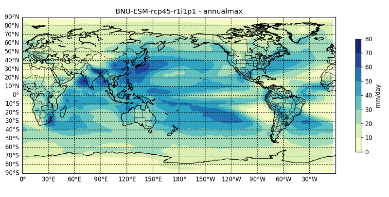

# Climate Indices

## Indices

More than 20 climate indices are available in the package, such as the annual number of tropical nights, annual maximum and minimum, etc. You can calculate such indices simply with:

```julia
ind = annualmax(C::ClimGrid)
```

Which returns another `ClimGrid`. You can also map this `ClimGrid` with the `mapclimgrid` function and returns the climatological mean of the annual maximum (e.g. daily precipitation in the example below). A list of indices can be found in the documentation and in the `functions.jl` source code.

```julia
mapclimgrid(C)
```



## Ensemble mean

You can calculate the ensemble mean with `ensemble_mean` function, where the input argument is an array of ClimGrids.

## Climate Indices

Here's a list of climate indices currently provided by ClimateTools. This list may not be always up-to-date. See [here](https://balinus.github.io/ClimateTools.jl/stable/functions.html) for all exported functions.

```@docs
annualmax
annualmean
annualmin
annualsum
approx_surfacepressure
customthresover
customthresunder
daysabove10
diurnaltemperature
icingdays
frostdays
prcp1
summerdays
tropicalnights
vaporpressure
wbgt
```
