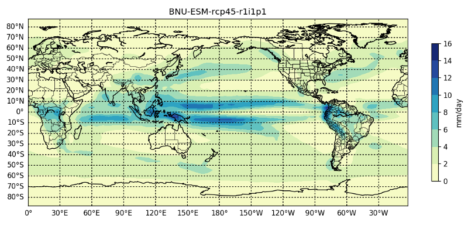

# Maps

## Mapping the ClimGrid type

Mapping climate information can be done by using [`mapclimgrid`](@ref).



```@docs
mapclimgrid
```

Note that the function plots the climatological mean of the provided `ClimGrid`. Multiple options are available for region: `World`, `Canada`, `Quebec`, `WorldAz`, `WorldEck4`, ..., and the default `auto` which use the maximum and minimum of the lat-long coordinates inside the `ClimGrid` structure. The user can also provide a polygon(s) and the `mapclimgrid` function will clip the grid points outside the specified polygon. Another option is to provide a mask (with dimensions identical to the spatial dimension of the `ClimGrid` data) which contains `NaN` and `1.0` and the data inside the `ClimGrid` struct will be clipped with the mask. Other regions will be added in the future, as well as the option to send a custom region defined by a lat-lon box.
